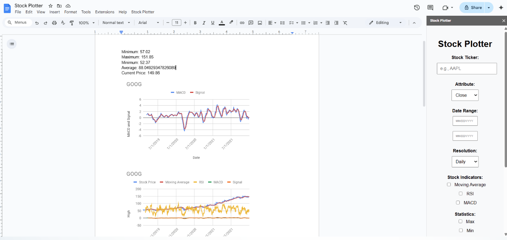

# 📈Stock Plotter

Stock Plotter is a Google Docs Add-on that lets you create stock charts, tables, and spreadsheets directly inside a Google Document, using market data fetched through the GoogleFinance API.

Built with Google Apps Script, HTML, and JavaScript, Stock Plotter unlocks the full potential of Google Sheets and Docs through seamless system integration.

## 🚀 Features

- **Chart generation**:

  - Moving Average
  - Relative Strength Index (RSI)
  - MACD

- **Customizable stock attributes**
  -open
  -close
  -high
  -low
  -volume
- **Table-based visualization**
- **Automatic financial statistics**:

  - Max, Min, Average
  - Start Price, End Price
  - Relative Change

  ## 📄 Project Structure

| File               | Purpose                                                                                        |
| :----------------- | :--------------------------------------------------------------------------------------------- |
| `Code.gs`          | Main backend logic for document generation, chart creation, and data handling.                 |
| `Sidebar.html`     | Frontend sidebar for user input (stock selection, dates, indicators, etc.).                    |
| `StockAnalyzer.gs` | Helper functions to calculate stock indicators (moving average, RSI, MACD) and key statistics. |

## 🖥️ How It Works

1. **Launch the Sidebar** from the "Stock Plotter" custom menu in Google Docs.
2. **Input Stock Details** (ticker, date range, resolution, indicators, and visualization type).
3. **Generate**:
   - If "Chart" is selected: a stock chart is created and inserted.
   - If "Table" is selected: raw stock data is displayed in a table.
4. **Analyze**:
   - Clickable links to the generated Google Spreadsheet are embedded in the Doc.
   - Pre-computed financial metrics inserted directly into the document.

   
